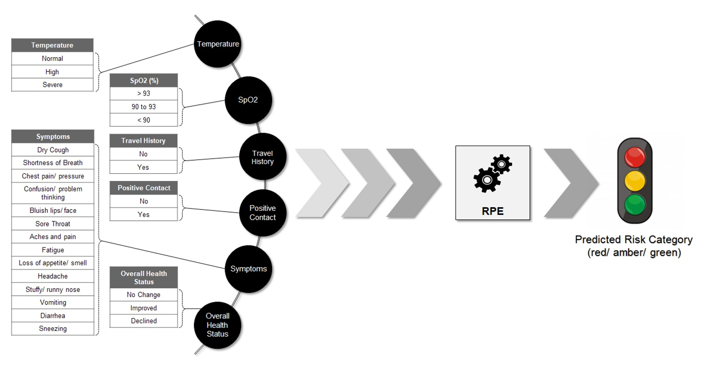
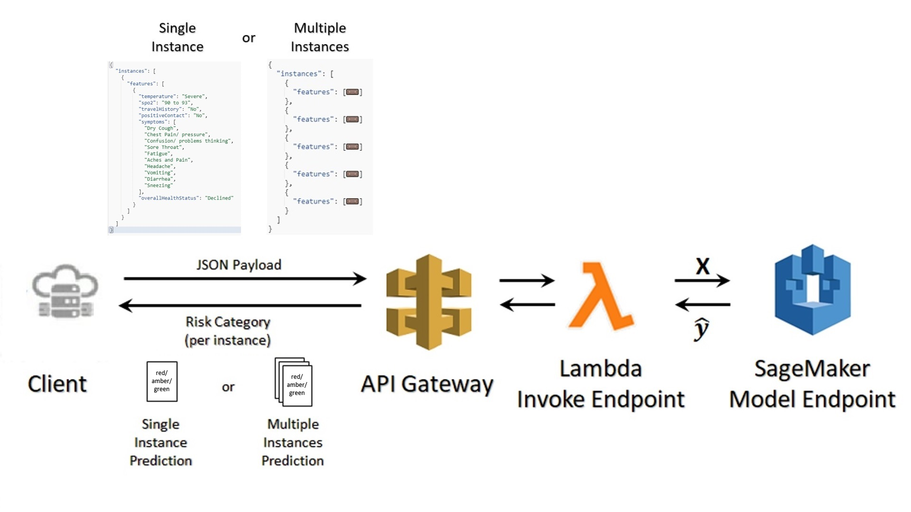

# Soteria Decisions: Risk Profile Engine #

## Risk Profile Engine Component ##
Risk Profile Engine (RPE) is one of the core components of Project Soteria as it enables other key modules that form part of the overall system.

At the core, the RPE is a prediction engine that is powered by a machine learning model that has been trained to classify risk.

RPE takes in various key parameters like the body temperature, SpO2 (oxygen level saturation), travel history, positive contact with an infected person, health symptoms, and overall health condition. Based on the inputs provided, the engine returns the predicted risk classification. Other application componenents like Workflow module could invoke the RPE service to get the predicted risk classification.

* Click <a href="./docs/about_risk_profile.md">here</a> to know more about what a risk profile is all about
* Click <a href="./docs/model_design.md">here</a> for details about the model that powers the service
* Click <a href="./docs/acessing_rpe_services.md">here</a> to know more about how to access the API and additional details about the RPE services

## Design and Architecture ##

### Design ###
The risk profile engine takes in key features as mentioned above in order to predict the risk category. The feature group is as follows:
  * Temperature
  * SpO2
  * Travel History
  * Positive Contact
  * Symptom(s)
  * Overall Health Status

  </img>

[</img>](#risk-profile-engine-component)

### Technical Architecture ###

  </img>

[</img>](#risk-profile-engine-component)
