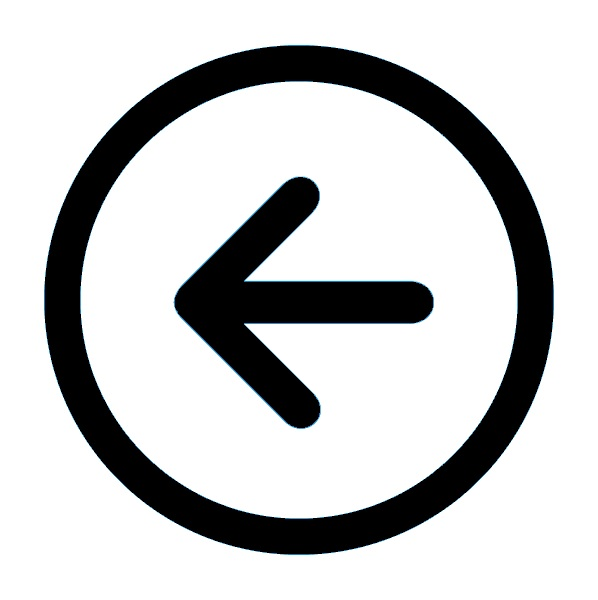

## What is a Risk Profile? ##
In the context of Project Soteria, risk profile is the risk status that an individual has acquired (and, is in) from the health and wellness standpoint at any given instance, by virtue of multiple factors like body temperature, spo2 level, recent travel history, coming in active contact with an infected person, symptoms, and the general health status. It is also important to note the risk profile is dynamic and changes through the lifecycle of events that an individual goes through like for instance, traveling to an affected geographic location, coming in close contact with an individual who had tested positive, newly noticed symptoms, health condition changes, etc.

The risk status could be used by an authorized body (an enterprise, a government, or other similar authority) to advise the individual (who is in their scope) of further steps/ provide guidelines to help them like advising them to be on self-quarantine, referring them to labs for further testing, instructing them to stay at home and be on leave of absence, assessing them (based on their risk status) to see if they could return to work (post lockdown or circuit breaker etc.) safely so that safety of their own and that of their fellow-employees is ensured.

<a href="../README.md"></img></a>
