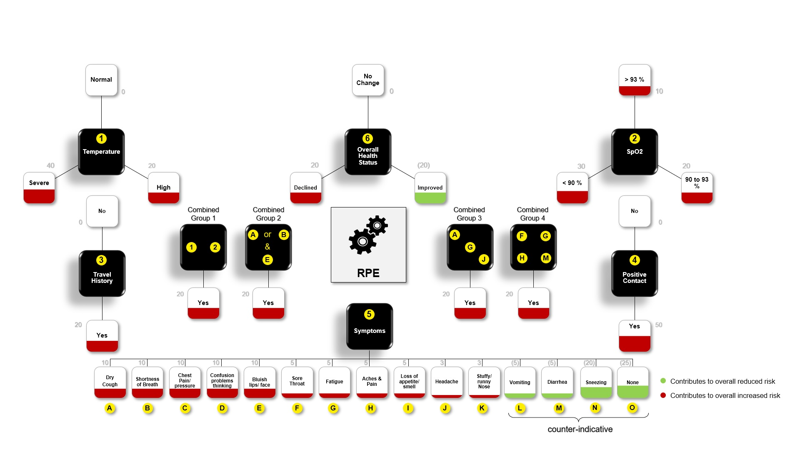
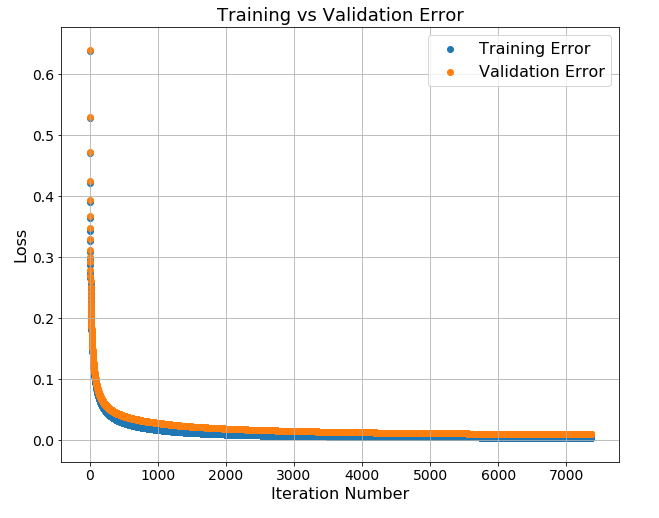
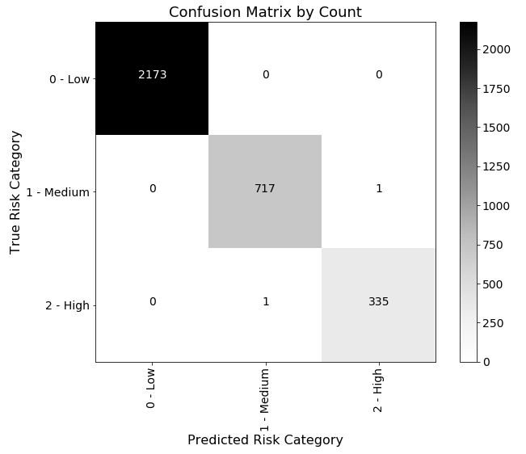
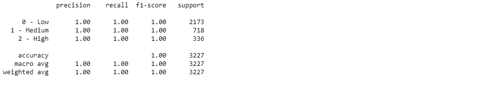

# Risk Profile Engine Model Details #
Model prediction accuracy is directly proportional to the quality of training data provided for the model to learn from. And so, for any machine learning model to be successful in accurately predicting the outcome, it is highly critical to have good quality data.

As mentioned earlier, RPE takes in various key parameters like the body temperature, oxygen saturation level, travel history, positive contact, health symptoms, and the overall health condition in order to predict the risk classification. For classifying the risk based on these features, Amazon SageMaker XGBoost (eXtreme Gradient Boosting) was leveraged. In order for the model to predict the risk classification, the same has been trained using a sizeable amount of training data.

## Data Strategy ##
The approach adopted in preparing high quality training data is as highlighted here:
*  Data generated at random - however, restricted to specific, valid values (refer to <a href="feature_code_mapping.md">value</a> column of the *Mapping of features to code table* for valid values for each of the feature groups):
      * Temperature [*note that the calling component could call the risk engine with a temperature value of Normal/ High/ Severe while it could define its own range of numeric values for the temperature under each of these values - for instance, Normal/ High/ Severe could be having a particular range of value in one geography whereas, it could be different for another geography*]
      * SpO2 %
      * Travel History
      * Positive Contact
      * Cross check of symptoms present/ non present
      * Overall Health Status according to presence of symptoms
    
* Adequate number of observations were created
  * Total of 160,000+ observations (161,318 observations to be precise) were created and the model was trained based on this dataset
  * Training data was labeled as low/ medium/ high (risk classification for a specific observation) based on score obtained using the scoring [rationale](#sroring-rationale-for-labeling)
  * Observations were [labeled](#labeled-risk-classification-ratio) into Low/ Medium/ High risk classification per the following ratio:
    * The observations having the lower most 67% of the scores were categorized as Low
    * The observations having the higher most 11% of the scores were categorized as High
    * The rest of the observations (the middle 22%) were categorized as Medium
  * Input features were <a href="feature_code_mapping.md">mapped</a> to numerical categorical variables to feed through the model algorithm
  * Prediction model
    * trained based on prepared dataset
    * health risk prediction is mapped (low risk to green, medium risk to amber, and high risk to red) to return green/ amber/ red status
  * It is to be noted that *the above-mentioned features used by the risk engine to predict the risk classification **does not include any personally identifiable information (PII)** and it is up to the calling component to appropriately use the prediction(s) while dealing with any PII at its end*
* As an initial step, to arrive at the classification label for the training data, a scoring rationale was adopted to classify the risk of each of the observations as given in the section below.

## Scoring Rationale for Labeling ##
For the model to learn effectively, based on the various feature values of each of the observation, a scoring mechanism was used to classify the risk and label the observations into one of three levels (low/ medium/ high). Based on the available literature as on date (of this work and documentation), it has been found that there are a few symptoms that suggest the candidate subject is Covid-19 infected though it may not be 100% accurate due to various reasons including evolving nature of the pandemic and the literature about its understanding. In addition, some symptoms (or a combination of few symptoms) are understood to be more indicative of the infection while a few of the symptoms are understood to be counter-indicative as well. The scoring rationale is based on this understanding. The following points highlight a few cases for better understanding:
* If the temperature feature of an instance in question is *Normal* then the contribution to the overall risk score is neutral, while if it is *High* then the contribution to the overall risk score is meduim, and alternatively, if the value for temperature is *Severe* then the contribution to the overall risk score is high. The score assignments for this scenario is 0, 20, and 40 respectively as could be seen from the image below.
* Similarly, if the Overall Health Status feature of an observation is found to be *Declined* then the contribution to the overall risk score is low, while if it is *Improved* it reduces the overall risk score and the contribution to the overall risk score is low (in the direction of reducing the overall score) and a value of *No Change* does not impact the risk score either way. The score assignments for this scenario is 20, -20, and 0 respectively as could be seen from the image below.
* Symptoms come in various forms. And, based on individual symptoms/ a combination of symptoms, the contribution towards the overall risk could be low/ medium/ high. It is also worth noting that if a subject instance has *No symptoms* it largely reduces the overall risk. And, some symptoms that were known to be counter-indicative also reduces the overall risk to some extent (while the final risk may depend on other combination of feature values).
* Some combination of symptoms also add more to risk and the same has been accounted for while devising the scoring rationale. For instance, if a subject instance has both *Severe* temperature and SpO2 % is *<90*, then, additionally, it adds more to the overall risk (this is identified by the *Combined Group 1* in the depiction below. While, a subject instance with *High* temperature and SpO2 % of *90 to 93* does not contribute additionally to the overall risk.

The picture below depicts the scoring rationale adopted to arrive at the training data for the model to train.

***Note: The rationale and/ or labeling based on scoring may need to be revisited as more literature becomes available from time-to-time due to the evolving nature of the disease and the contributing symptoms***.

  </img>

## Labeled Risk Classification Ratio ##
* Total observations: 161,318
  * Low risk: 108,639 (~ 67%)
  * Medium risk: 35,894 (~ 22%)
  * High risk: 16,785 (~ 11%)

## Training Process - Data Split Ratio ##
For the model training purposes, the overall data was split into training, validation, and test sets. The test:validation:test split ratio was kept at 73:25:2 for these sets and was used to train, validate, and evaluate the model performance respectively.
* Total observations: 161,318
  * Training: 117,762 (~ 73%)
  * Validation: 40,329 (~ 25%)
  * Test: 3,227 (~ 2%)

From the ratio specified above, the test dataset composition is as follows:
  * Low risk: 2,173
  * Medium risk: 718
  * High risk: 336

## Model Training ##
The model was trained to predict the risk classification based on the input features and the above approach. The following snapshot images summarize the model performance.

### Training vs Validation Error ###

  </img>

### Confusion Matrix (based on observation count) ###

  </img>

### Model Performance Metrics ###

  </img>

[</img>](#risk-profile-engine-model-details)

<a href="../README.md"></img></a>
